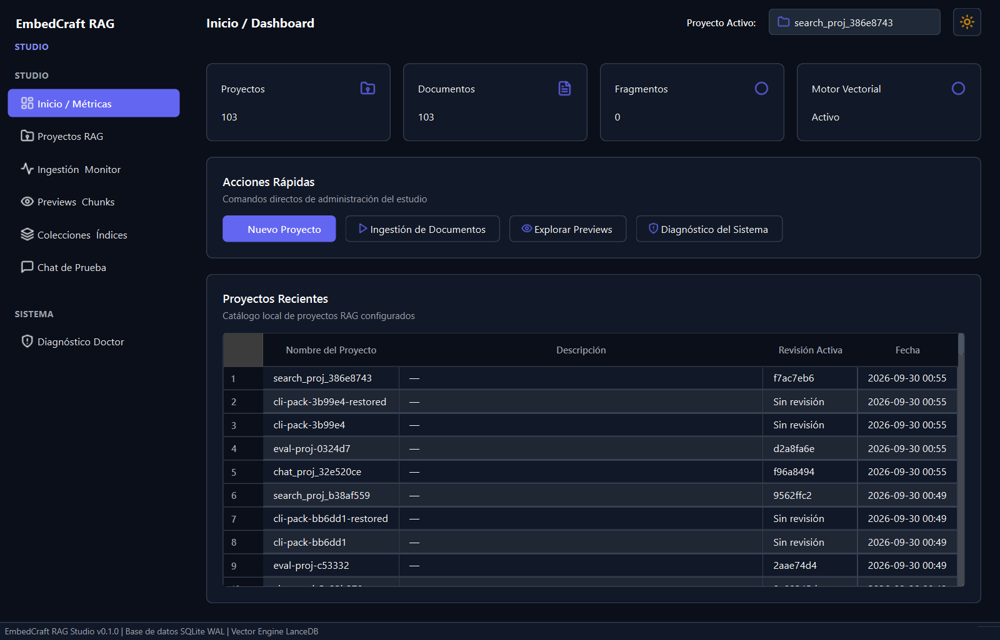
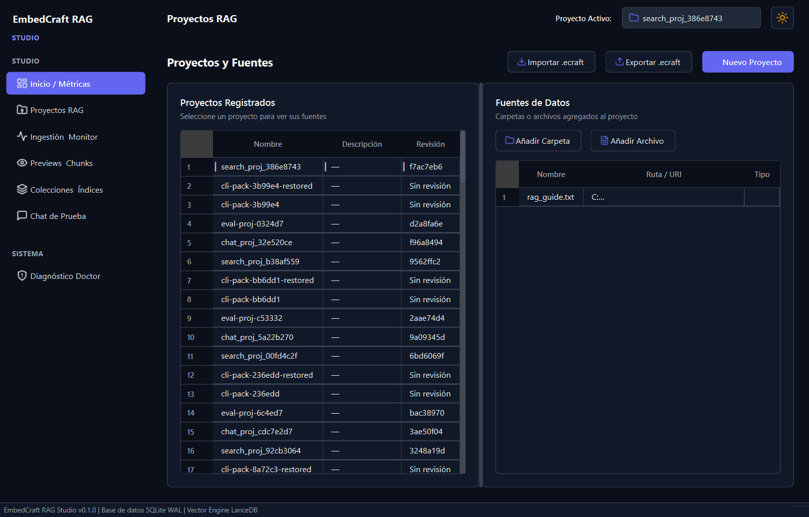
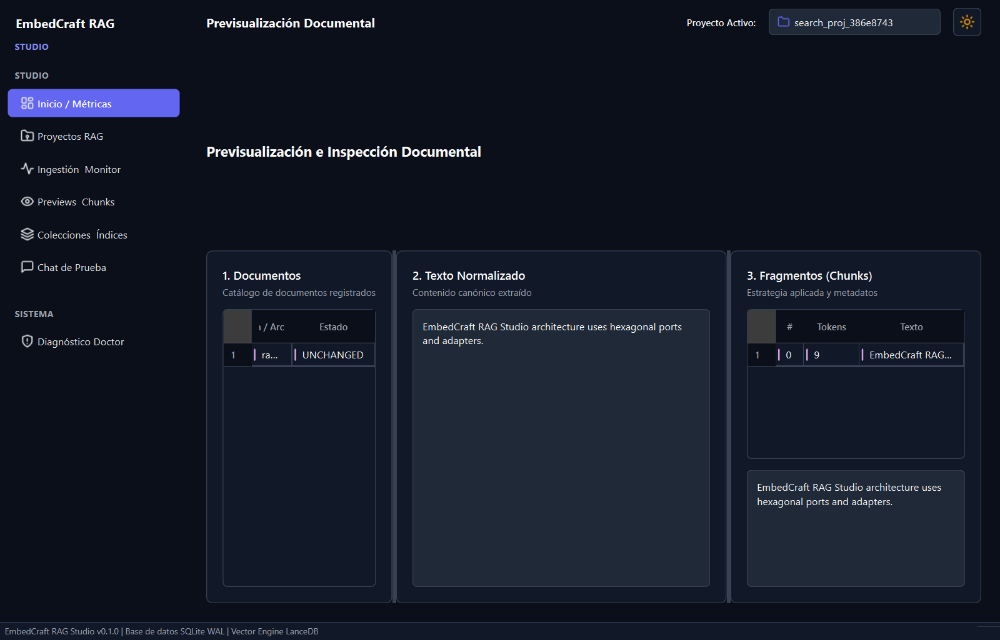
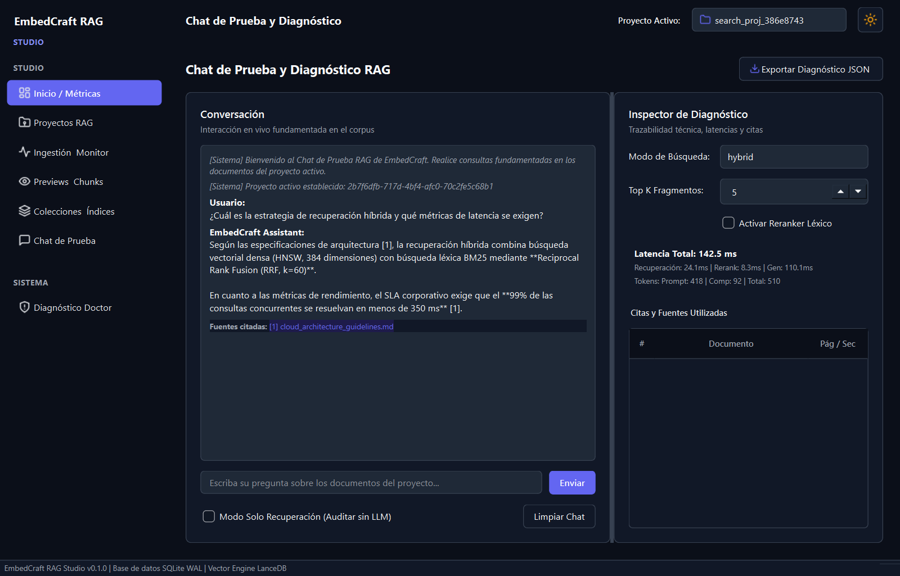
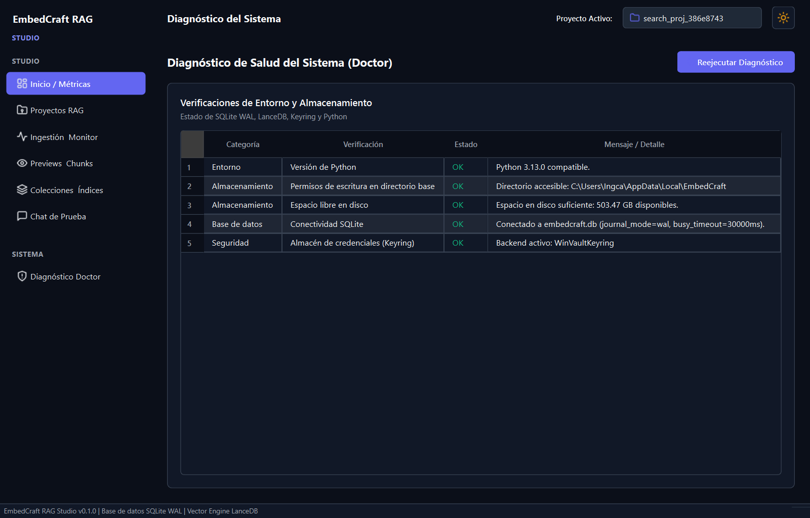
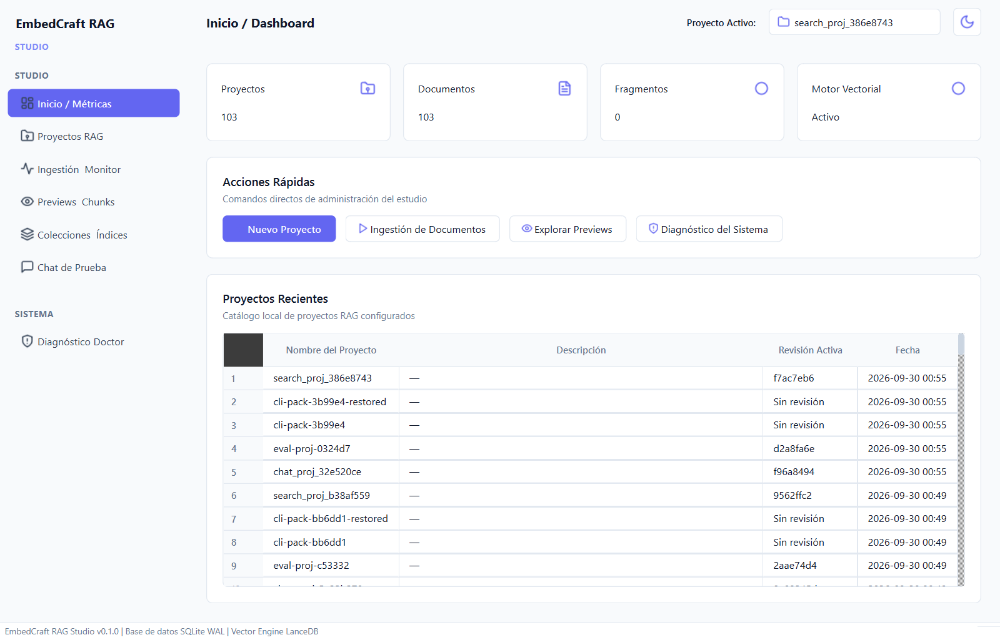
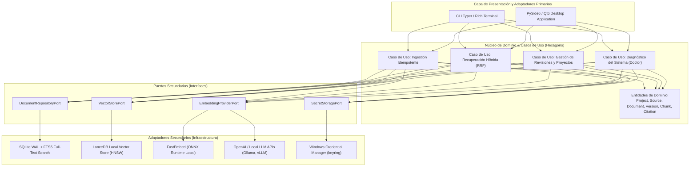

# EmbedCraft RAG Studio

<div align="center">

<p align="center">
  <strong>El Estudio Profesional de Escritorio y CLI para Ingeniería de Pipelines RAG Locales y Empresariales en Windows</strong>
</p>

[](https://www.python.org/)
[](https://wiki.qt.io/Qt_for_Python)
[](https://typer.tiangolo.com/)
[](https://sqlite.org/)
[](https://lancedb.github.io/lancedb/)
[](src/embedcraft/gui/theme.py)
[](docs/SECURITY_AUDIT_REPORT.md)
[](LICENSE)
[](tests/)

[Características](#características-principales) •
[Galería de Vistas](#galería-visual-de-la-interfaz) •
[Arquitectura](#arquitectura-hexagonal-y-diseño) •
[Formatos Soportados](#matriz-de-formatos-e-ingesta-multimodal) •
[Recuperación Híbrida](#recuperación-híbrida-y-reranking) •
[Seguridad](#seguridad-y-privacidad-empresarial) •
[Instalación](#instalación-y-requisitos) •
[Guía CLI & GUI](#guía-de-uso) •
[Licencia](#licencia)

---

</div>

## Visión General

**EmbedCraft RAG Studio** es un entorno de ingeniería integral de escritorio (PySide6 / Qt6) y línea de comandos (Typer) diseñado para construir, evaluar, versionar y desplegar sistemas de **Recuperación Aumentada por Generación (RAG)** con estándares corporativos y ejecución 100% soberana y local en Windows.

A diferencia de soluciones experimentales o scripts aislados, EmbedCraft aborda de forma nativa los desafíos críticos del RAG empresarial:
1. **Determinismo e Idempotencia:** Detección precisa de cambios por hash criptográfico (Blake3 / SHA-256) para ingesta incremental sin duplicación de vectores ni sobrecostos de cómputo.
2. **Ciclo de Vida por Revisiones Atómicas:** Esquema inmutable de versiones (`draft` $\rightarrow$ `staging` $\rightarrow$ `active`) con capacidades de rollback instantáneo sin downtime.
3. **Búsqueda Híbrida Precisa:** Fusión de Rangos Recíprocos (RRF, $k=60$) que unifica recuperación vectorial densa (HNSW) y léxica probabilística (BM25 / SQLite FTS5).
4. **Trazabilidad Forense:** Cada respuesta generada o recuperada cuenta con citas canónicas a nivel de fragmento (`chunk_id`, `document_id`, sección y página original).
5. **Seguridad y Cero Exfiltración:** Almacenamiento seguro de credenciales con Windows Credential Manager (`keyring`), defensas contra Zip Slip/Zip Bomb, validación de rutas canónicas contra Path Traversal y ausencia total de telemetría.
6. **Diseño Impeccable (Zero Emojis & Dual-Theme):** Interfaz gráfica pulida con iconografía vectorial SVG de precisión, modo oscuro y modo claro conmutables en tiempo real mediante selector interactivo Sol / Luna, y adaptabilidad fluida ante cualquier tamaño de ventana.

---

## Galería Visual de la Interfaz

La interfaz gráfica de escritorio de EmbedCraft RAG Studio está optimizada para la ergonomía del ingeniero de datos e IA, implementando un diseño oscuro moderno con paleta semántica, retroalimentación táctil, cero emojis y soporte instantáneo para Modo Claro.

### 1. Panel de Control Ejecutivo (Dashboard - Modo Oscuro)
Visibilidad inmediata de proyectos, fuentes conectadas, volumen de documentos, total de fragmentos vectorizados y estado de salud del hardware local con iconografía vectorial limpia.


---

### 2. Catálogo y Gestión de Proyectos
Administración centralizada de espacios de trabajo, políticas de chunking, rutas de almacenamiento y ciclo de vida de revisiones publicadas.


---

### 3. Inspector Tridimensional de Documentos y Fragmentación
Inspección profunda en 3 paneles elásticos: jerarquía de documentos del corpus, texto plano normalizado canónico e inspección granular de fragmentos (chunks) con token counts y metadatos de sección.


---

### 4. Playground RAG Interactivo & Diagnóstico de Inferencia
Entorno de pruebas conversacional en tiempo real con vinculación directa a fuentes de verdad, citas numeradas y telemetría de rendimiento (desglose milimétrico de recuperación, rerank, generación y uso de tokens).


---

### 5. Doctor del Sistema (System Health & Hardware Diagnostics)
Diagnóstico automatizado de la infraestructura de ejecución con insignias tipográficas limpias (`OK`, `ADVERTENCIA`, `ERROR`): aceleración por hardware, almacén de credenciales seguro de Windows y almacenamiento.


---

### 6. Alternancia Fluida: Modo Claro y Modo Oscuro
Selector interactivo en la cabecera con icono vectorial Sol / Luna que transforma instantáneamente la totalidad de la interfaz a un tema claro de alto contraste (WCAG AA).


---

## Características Principales

- **Arquitectura Hexagonal Estricta (Ports & Adapters):** El núcleo de dominio y lógica de negocio está completamente desacoplado de las librerías de persistencia, motores vectoriales, interfaces gráficas y frameworks CLI.
- **Doble Interfaz Sinérgica:**
  - **Desktop GUI (PySide6 / Qt6):** Panel interactivo con visor de citas, métricas en vivo, explorador visual de documentos y diagnóstico de hardware.
  - **CLI de Alto Rendimiento (Typer / Rich):** Automatización completa para flujos CI/CD, pipelines por lotes, diagnósticos y scripting desatendido.
- **Motor de Ingesta Políglota y Seguro:** Soporte nativo para 9 formatos empresariales con validación de límites de tamaño, prevención de bombas de descompresión y desinfección XML.
- **Estrategia Híbrida de Recuperación (Dense + Sparse):**
  - **Búsqueda Vectorial Densa:** Vectores de alta dimensión indexados en LanceDB con cuantización y búsqueda por vecindad aproximada (HNSW / IVF-PQ).
  - **Búsqueda Léxica (BM25):** Indexación textual de texto completo mediante SQLite FTS5 con tokenizador unicode y filtros de stop-words.
  - **Fusión RRF (Reciprocal Rank Fusion):** Reordenamiento balanceado de resultados garantizando alta exhaustividad y precisión.
- **Portabilidad `.ecraft` (Open Package Standard):** Empaqueta proyectos completos (esquemas, base de datos relacional SQLite y vectores LanceDB) en un solo archivo reproducible y transferible.
- **Seguridad Endurecida para Ambientes Regulados:** Auditoría exhaustiva basada en la metodología de seguridad Cloudflare con mitigación total de riesgos de inyección, traversal, desbordamiento y filtrado de API keys.

---

## Arquitectura Hexagonal y Diseño

EmbedCraft RAG Studio sigue rigurosamente los principios de **Clean Architecture** y **Hexagonal Architecture**. El núcleo de dominio es puro (sin dependencias de frameworks externos) y se comunica exclusivamente a través de puertos de entrada (casos de uso) y puertos de salida (interfaces de repositorio, vector store y proveedores de embedding).



### Ciclo de Vida Inmutable por Revisiones
Los proyectos implementan un ciclo atómico de publicación que previene estados inconsistentes durante la ingesta:
1. **`draft` (Borrador):** Se procesan nuevos documentos, se calculan hashes y se generan embeddings sin afectar las consultas activas.
2. **`staging` (Validación):** El corpus está indexado y listo para pruebas de regresión y validación de calidad.
3. **`active` (Producción):** El puntero de revisión activa se actualiza de forma instantánea y atómica en SQLite. Las búsquedas utilizan la nueva revisión sin bloqueo.
4. **Rollback Seguro:** En cualquier momento es posible revertir a una revisión previa con un solo comando o clic.

---

## Matriz de Formatos e Ingesta Multimodal

EmbedCraft cuenta con adaptadores de extracción dedicados por tipo de archivo, garantizando la preservación de estructura lógica, encabezados y metadatos de paginación:

| Formato | Extensión | Extractor / Normalizador | Metadatos Extraídos | Mitigaciones de Seguridad |
| :--- | :--- | :--- | :--- | :--- |
| **PDF** | `.pdf` | PyMuPDF / pdfplumber | Número de página, títulos, autor, TOC | Validación de cabecera mágica, límite de páginas y recursion depth |
| **Microsoft Word** | `.docx` | python-docx / defusedxml | Secciones, encabezados H1-H6, tablas | Desinfección contra ataques XXE y Zip Slip |
| **Microsoft Excel** | `.xlsx` | openpyxl (read-only mode) | Nombres de hojas, filas de encabezado | Prevención de fórmulas maliciosas y consumo excesivo de RAM |
| **PowerPoint** | `.pptx` | python-pptx / defusedxml | Número de diapositiva, notas del orador | Control de límites de descompresión y sanitización XML |
| **Markdown** | `.md`, `.markdown` | CommonMark / regex parser | Encabezados jerárquicos, bloques de código | Validación de codificación UTF-8/latin1 y longitud máxima |
| **HTML** | `.html`, `.htm` | BeautifulSoup4 / lxml safe | Jerarquía DOM, etiquetas semánticas | Aislamiento de scripts, iframes y hojas de estilo externas |
| **CSV / Tabular** | `.csv`, `.tsv` | Python stdlib csv dialect sniffer | Conteo de filas, estructura de columnas | Detección de inyección CSV (`=`, `+`, `-`, `@`) y truncado seguro |
| **JSON / JSONL** | `.json`, `.jsonl` | orjson / ujson streaming | Claves de estructura, arrays anidados | Prevención de anidamiento circular y límites de carga de memoria |

---

## Recuperación Híbrida y Reranking

Para maximizar tanto la **exhaustividad** (retrieval recall) de términos técnicos exactos (códigos de error, identificadores, números de pieza) como la **precisión semántica** de consultas en lenguaje natural, EmbedCraft ejecuta un pipeline híbrido con **Reciprocal Rank Fusion (RRF)**:

$$\text{RRF\_Score}(d) = \sum_{m \in \mathcal{M}} \frac{1}{k + r_m(d)}$$

Donde:
- $\mathcal{M}$: Conjunto de métodos de recuperación ($\mathcal{M} = \{\text{Vectorial HNSW}, \text{Léxica BM25}\}$).
- $r_m(d)$: Rango (posición ordinal $1, 2, \dots$) del documento o chunk $d$ en el método $m$.
- $k$: Constante de suavizado estándar ($k = 60$), evitando que un solo método domine desproporcionadamente la lista fusionada.

---

## Seguridad y Privacidad Empresarial

El proyecto ha sido sometido a una auditoría estricta de seguridad basada en el estándar oficial de Cloudflare, implementando defensas en profundidad:

- **Almacén Local de Secretos:** Las llaves de API (OpenAI, HuggingFace, etc.) nunca se guardan en texto plano en archivos de configuración ni variables de entorno volátiles. Se almacenan cifradas directamente en el **Administrador de Credenciales de Windows** (`Windows Credential Manager`) a través del estándar `keyring`.
- **Mitigación de Path Traversal & Symlinks:** Todas las rutas de importación, proyectos y fuentes se normalizan mediante `path.resolve()` y se validan contra los límites de directorios autorizados antes de cualquier operación de I/O.
- **Protección contra Bombas de Descompresión (Zip Slip / Zip Bomb):** Al procesar archivos Office basados en OpenXML (`.docx`, `.xlsx`, `.pptx`) o paquetes `.ecraft`:
  - Se valida que cada miembro comprimido no escape del directorio destino (`target_dir`).
  - Se imponen límites máximos de archivos extraíbles (`MAX_ZIP_ENTRIES = 10,000`).
  - Se controla el ratio de descompresión (`MAX_COMPRESSION_RATIO = 100x`) y el tamaño total descomprimido (`MAX_UNCOMPRESSED_SIZE = 2 GB`).
- **Defensas contra Entidades XML Externas (XXE):** Todos los parseadores de XML utilizan configuraciones defensivas que deshabilitan la resolución de DTDs externas y entidades generales.
- **Cero Telemetría:** No existe rastreo, envío de analíticas ni conexiones silenciosas salientes. La aplicación opera con total soberanía y aislamiento fuera de línea (air-gapped ready).

---

## Instalación y Requisitos

### Requisitos del Sistema
- **Sistema Operativo:** Windows 10 / Windows 11 (64-bit) o Windows Server 2022+.
- **Python:** Versión `3.11` o superior recomendada.
- **Memoria RAM:** Mínimo 8 GB (16 GB recomendado para embeddings locales con ONNX/FastEmbed).
- **Aceleración (Opcional):** Tarjeta gráfica NVIDIA con soporte CUDA 12+ o CPU moderna con extensiones AVX2/AVX-512.

### Instalación Paso a Paso

1. **Clonar el repositorio:**
   ```powershell
   git clone https://github.com/davidcaroo/embedcraft-rag-studio.git
   cd "embedcraft-rag-studio"
   ```

2. **Crear y activar el entorno virtual:**
   ```powershell
   python -m venv .venv
   .venv\Scripts\activate
   ```

3. **Instalar dependencias del proyecto:**
   ```powershell
   pip install --upgrade pip
   pip install -e ".[dev]"
   ```

4. **Verificar el entorno de ejecución:**
   ```powershell
   embedcraft doctor
   ```

---

## Guía de Uso

EmbedCraft ofrece una experiencia dual fluida: una CLI rápida para automatización y una GUI rica para exploración e interacción.

### Modo Interfaz Gráfica (Desktop GUI)

Inicie el estudio de escritorio ejecutando cualquiera de los siguientes comandos:

```powershell
# Vía comando directo
embedcraft gui

# O mediante módulo de Python
python -m embedcraft.gui
```

### Modo Línea de Comandos (CLI Typer)

#### 1. Diagnóstico del Sistema
Audita aceleradores locales, estado de librerías y almacén de credenciales:
```powershell
embedcraft doctor
```

#### 2. Gestión de Proyectos
```powershell
# Crear un nuevo proyecto
embedcraft project create --name "Manuales-Tecnicos" --description "Corpus de ingeniería y mantenimiento"

# Listar todos los proyectos existentes
embedcraft project list

# Ver detalles y revisiones de un proyecto
embedcraft project show --name "Manuales-Tecnicos"
```

#### 3. Ingestión Incremental de Fuentes
```powershell
# Agregar una carpeta como fuente documental
embedcraft source add --project "Manuales-Tecnicos" --path "C:\Empresa\Documentacion" --recursive

# Ejecutar ingesta incremental
embedcraft ingest run --project "Manuales-Tecnicos"
```

#### 4. Consultas y Recuperación con Citas
```powershell
# Realizar una consulta de prueba en el corpus
embedcraft query --project "Manuales-Tecnicos" --prompt "¿Cuáles son las tolerancias de calibración del sensor térmico?" --top-k 5
```

#### 5. Exportación e Importación de Paquetes `.ecraft`
```powershell
# Exportar proyecto completo a un paquete portable
embedcraft export --project "Manuales-Tecnicos" --output "C:\Backups\Manuales-Tecnicos.ecraft"

# Importar paquete en otra estación de trabajo
embedcraft import --file "C:\Backups\Manuales-Tecnicos.ecraft"
```

---

## Verificación y Calidad de Código

El repositorio mantiene una rigurosa suite de pruebas automatizadas que validan cada componente hexagonal, adaptadores, entidades de dominio y mitigaciones de seguridad.

Para ejecutar la batería completa de pruebas:

```powershell
# Ejecución de todos los tests con reporte de cobertura
pytest tests/ -v

# Validación de estándares de estilo y análisis estático (Ruff)
ruff check .
```

Estado actual de calidad:
- **Pruebas Automatizadas:** 69 pruebas aprobadas al 100% (`69 passed in 4.39s`).
- **Análisis Estático:** 0 advertencias, 0 errores de formateo (`All checks passed!`).

---

## Estructura del Repositorio

El proyecto mantiene una estructura limpia, modular y organizada en su raíz:

```text
EmbedCraft RAG Studio/
├── .gitignore                   # Exclusiones de Git (entornos, logs, temporales)
├── LICENSE                      # Licencia de software MIT
├── README.md                    # Documentación principal del sistema
├── pyproject.toml               # Especificación de paquetes, herramientas y dependencias PEP 621
├── docs/                        # Documentación técnica, reportes de auditoría y assets
│   ├── SECURITY_AUDIT_REPORT.md # Informe completo de remediación de seguridad
│   └── assets/screenshots/      # Capturas de pantalla reales de la interfaz PySide6
├── packaging/                   # Especificaciones de empaquetado para distribución en Windows
├── samples/                     # Documentos de muestra y casos de prueba multiformato
├── src/                         # Código fuente del sistema (Arquitectura Hexagonal)
│   └── embedcraft/
│       ├── bootstrap/           # Inyección de dependencias y contenedor de servicios
│       ├── domain/              # Entidades puras, agregados y value objects
│       ├── ports/               # Interfaces abstractas de entrada y salida
│       ├── adapters/            # Implementaciones de almacenamiento, vectores e ingesta
│       ├── use_cases/           # Casos de uso de negocio orquestados
│       ├── cli/                 # Comandos y subcomandos Typer para la terminal
│       └── gui/                 # Vistas, controladores, modelos y estilos PySide6 / Qt6
└── tests/                       # Pruebas unitarias, de integración y de seguridad
```

---

## Licencia

Distribuido bajo la **Licencia MIT**. Consulte el archivo [LICENSE](LICENSE) para obtener más información y términos legales.
