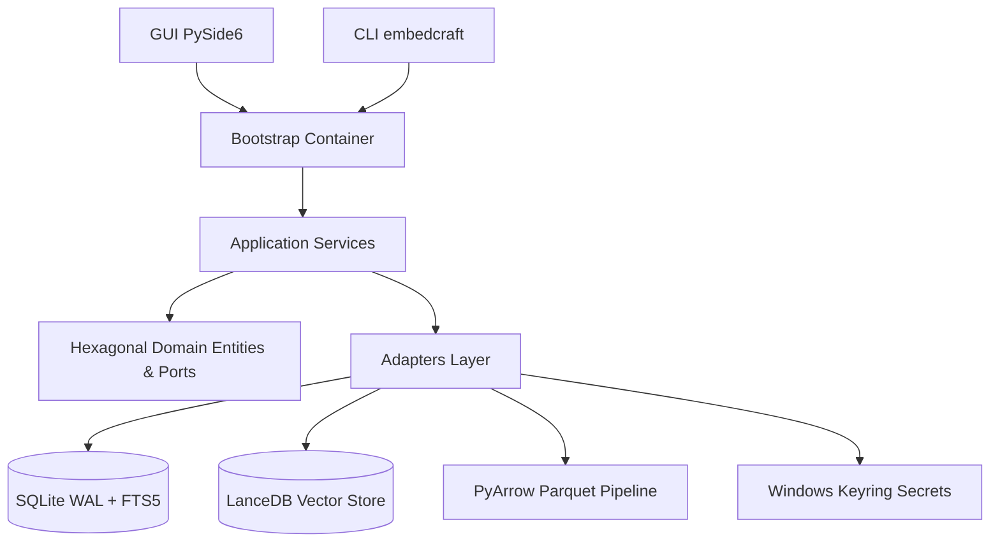

# Arquitectura General de EmbedCraft RAG Studio

## Visión General
EmbedCraft RAG Studio es un entorno de ingeniería local y de escritorio para la construcción, indexación, evaluación y consulta de sistemas de Generación Aumentada por Recuperación (RAG).

## Capas del Sistema

### 1. Dominio (`src/embedcraft/domain/`)
- **Entidades puras**: `Project`, `Source`, `Document`, `DocumentVersion`, `Chunk`, `Collection`, `IndexRevision`, `Job`, `Citation`, `RetrievalResult`, `ExportManifest`.
- **Objetos de valor**: `DocumentStatus`, `RevisionStatus`, `SearchMode`, `DistanceMetric`, `ChunkMetadata`.
- **Excepciones semánticas**: códigos estables `ERR_*`, mensaje amigable, detalle técnico, acción recomendada, ID de correlación y capacidad de reintento.

### 2. Puertos (`src/embedcraft/ports/`)
- `EmbeddingProvider`: cálculo de vectores densos.
- `VectorStore`: almacenamiento y consulta de similitud por distancia coseno o euclidiana.
- `LexicalStore`: índice invertido y búsqueda de texto completo con ranking BM25.
- `LLMProvider`: generación de respuestas y streaming de tokens.
- `RerankerProvider`: reordenamiento semántico o léxico de resultados de recuperación.
- `SecretStore`: custodia cifrada de credenciales API.

### 3. Adaptadores (`src/embedcraft/adapters/`)
- Persistencia relacional en SQLite con WAL y foreign keys activadas.
- Base vectorial `LanceDBVectorStore` con almacenamiento en disco y soporte `MemoryVectorStore` para pruebas ultrarrápidas.
- Proveedor de LLM `OpenAICompatibleProvider` y `MockLLMProvider` determinista.
- Reranker de scoring léxico contextual ponderado.
- Secret store nativo con `keyring` (Windows Credential Locker).

### 4. Servicios de Aplicación (`src/embedcraft/application/services/`)
- `ProjectService`: ciclo de vida de proyectos y fuentes.
- `IngestionService`: pipeline documental incremental (descubrir -> extraer -> normalizar -> fragmentar).
- `IndexingService`: vectorización, publicación atómica de revisiones y búsqueda híbrida con RRF.
- `ChatService`: orquestación de RAG, grounding estricto, diagnóstico de latencia y exportación.
- `ExportService` e `ImportService`: empaquetado portable `.ecraft`, validación SHA-256 y defensa contra Zip Slip.
- `EvaluationService`: benchmark de recuperación (Recall@K, Hit Rate, MRR, Cobertura de citas).
- `SystemService`: diagnóstico interactivo de salud (`doctor`).
