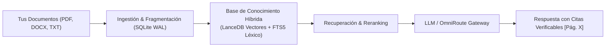
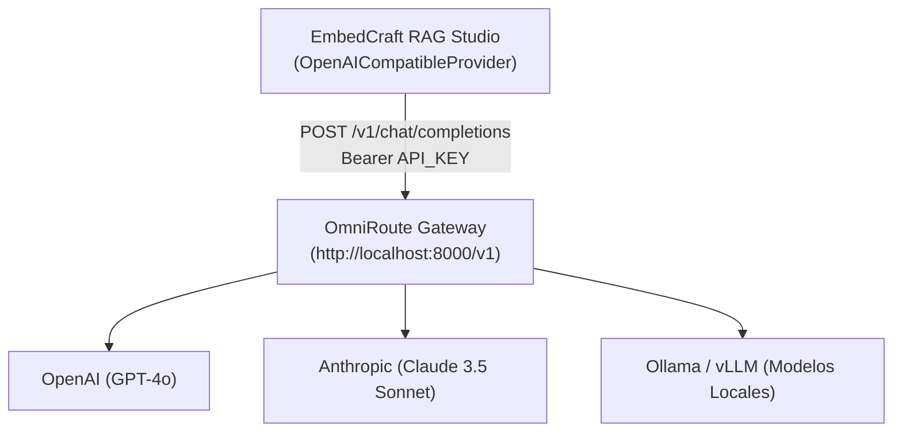

# Manual de Usuario y Arquitectura — EmbedCraft RAG Studio

## 1. Introducción y Propósito del Sistema

**EmbedCraft RAG Studio** es una plataforma de **Generación Aumentada por Recuperación (RAG)** de arquitectura hexagonal diseñada para operar en entornos locales de forma privada, determinista y auditable.

El objetivo central del sistema es transformar colecciones de documentos desestructurados (archivos PDF, Word, Markdown, hojas de cálculo, presentaciones y texto plano) en **bases de conocimiento vectoriales y léxicas** que permitan a modelos de inteligencia artificial (LLMs) responder preguntas complejas citando con exactitud la página, sección y documento de respaldo, eliminando las alucinaciones.



---

## 2. Cómo se Conecta a los LLMs y Cómo Crea Bases de Conocimiento

### 2.1 La Conexión con Modelos de Lenguaje (LLMs)
En EmbedCraft, los modelos de lenguaje no están acoplados directamente al código central; se comunican mediante un **Puerto de Abstracción (`LLMProvider`)**:

* **Puerto (`embedcraft.ports.llm.LLMProvider`):** Define el contrato que cualquier motor de IA debe cumplir: recibir un prompt contextualizado y devolver el contenido generado, los tokens consumidos y la latencia.
* **Adaptadores Disponibles:**
  1. `MockLLMProvider`: Motor de prueba determinista y sin costo, utilizado para entornos sin conexión a internet ni claves de API. Extrae y resume de forma fiel los fragmentos recuperados.
  2. `OpenAICompatibleProvider`: Adaptador universal que implementa el protocolo estándar de completions (`/v1/chat/completions`). Es compatible de forma nativa con **OpenAI**, **Ollama**, **vLLM**, **LiteLLM** y pasarelas como **OmniRoute**.

### 2.2 ¿Puede crear una Base de Conocimientos para alimentar al LLM?
**Sí. Cada proyecto en EmbedCraft es en sí mismo una Base de Conocimientos completa, estructurada y versionada:**

1. **Almacenamiento Vectorial Semántico (LanceDB):** Cada fragmento de texto es transformado en un vector matemático de alta dimensión (ej. 384 dimensiones con MiniLM). Esto permite al LLM comprender el significado y la intención de una pregunta aunque no coincidan las palabras literales.
2. **Índice Léxico Completo (SQLite FTS5):** Permite localizar códigos de error, referencias normativas, nombres propios o identificadores exactos.
3. **Fusión de Rangos Recíprocos (RRF - Hybrid Search):** Combina matemáticamente lo mejor de la búsqueda vectorial y la búsqueda por palabras clave en una sola lista ponderada.
4. **Alimentación en Tiempo de Ejecución (Runtime Ingestion):** No se requiere reentrenar (*fine-tuning*) al LLM. Cuando el usuario pregunta, la base de conocimientos le inyecta dinámicamente al modelo solo los fragmentos pertinentes empaquetados en un contenedor seguro (`<untrusted_document_context>`), garantizando precisión y velocidad.
5. **Portabilidad `.ecraft`:** Puedes exportar cualquier base de conocimientos como un archivo único comprimido `.ecraft` para compartirla con otros equipos, desplegarla en un servidor o utilizarla en flujos de integración continua (CI/CD).

---

## 3. Guía de Uso Paso a Paso (Flujo de Trabajo Cotidiano)

### Paso 1: Creación del Proyecto
1. Abre la aplicación ejecutando `launch_gui.bat`.
2. En la barra lateral, haz clic en **Proyectos RAG**.
3. Presiona **Nuevo Proyecto**, asigna un nombre descriptivo (ej. `Auditoría Contable 2026` o `Documentación Técnica`) y haz clic en Guardar.
4. Selecciona el proyecto en la tabla y presiona **Agregar Carpeta** o **Agregar Archivo** para vincular tus fuentes documentales.

### Paso 2: Ingestión y Construcción de la Base de Conocimiento
1. En la barra lateral, dirígete a **Ingestión & Monitor**.
2. Observarás el flujo de 5 etapas: `1. Descubrir -> 2. Extraer -> 3. Normalizar -> 4. Fragmentar -> 5. Indexar`.
3. Haz clic en **Iniciar Ingestión Incremental**.
4. El sistema leerá los archivos y, gracias a la casilla *"Publicar índice automáticamente al terminar ingestión"*, generará de forma transparente los embeddings e indexará los vectores en LanceDB.
5. El estado final mostrará **Índice Activo**, lo que confirma que la base de conocimientos está lista para ser consultada.

### Paso 3: Consultas y Auditoría en el Chat
1. Ve a la vista **Chat de Prueba**.
2. En la parte derecha dispones del **Inspector de Diagnóstico**:
   * **Modo de Búsqueda:** `hybrid` (recomendado), `vector` o `lexical`.
   * **Top K Fragmentos:** Cantidad de fragmentos que alimentarán al LLM (por defecto 5).
   * **Activar Reranker Léxico:** Reordena los fragmentos por relevancia contextual antes de pasarlos al LLM.
   * **Modo Solo Recuperación:** Marca esta casilla si deseas auditar qué fragmentos encuentra el buscador sin invocar al LLM.
3. Escribe tu pregunta en el cuadro de texto y presiona **Enviar**.
4. El sistema responderá fundamentando su respuesta en tus documentos y desplegará en la tabla inferior las **Citas y Fuentes** con el número de página y sección correspondiente.

---

## 4. Integración Pendiente con OmniRoute

**OmniRoute** actúa como un enrutador inteligente de IA que centraliza múltiples proveedores (Claude de Anthropic, GPT-4 de OpenAI, DeepSeek, Llama 3 en servidores propios) exponiendo una interfaz unificada compatible con OpenAI.

### Arquitectura de Integración



### Configuración Técnica Necesaria

El adaptador `OpenAICompatibleProvider` ya se encuentra implementado en `src/embedcraft/adapters/llm/openai_provider.py`. Para enlazarlo de forma permanente con OmniRoute se requiere:

1. **Variables de Configuración en `Settings` (`src/embedcraft/infrastructure/settings.py`):**
   * `llm_provider_type`: `"omniroute"` (o `"openai_compatible"`).
   * `omniroute_base_url`: URL del gateway (por ejemplo: `http://localhost:8000/v1` o la URL de tu instancia de OmniRoute).
   * `omniroute_api_key`: Clave de acceso configurada en OmniRoute.
   * `omniroute_model`: Nombre del modelo a solicitar (ejemplo: `claude-3-5-sonnet`, `gpt-4o`, `llama-3.1-70b`).

2. **Inyección en el Contenedor (`src/embedcraft/bootstrap/container.py`):**
   Configurar el contenedor de dependencias para inicializar automáticamente el proveedor:
   ```python
   if settings.llm_provider_type == "omniroute":
       self.llm_provider = OpenAICompatibleProvider(
           base_url=settings.omniroute_base_url,
           api_key=settings.omniroute_api_key,
           model_name=settings.omniroute_model,
           timeout_seconds=90.0,
       )
   ```

3. **Panel de Ajustes en la GUI:**
   Incorporar una pestaña de **Configuración / Ajustes** en la barra lateral donde el usuario pueda escribir la URL de OmniRoute, su clave de acceso y seleccionar el modelo desde un menú desplegable sin tener que editar archivos de código.

---

## 5. Qué Hace Falta para Potenciar al Máximo el Sistema

Para llevar EmbedCraft RAG Studio a un nivel corporativo de máximo rendimiento, las siguientes líneas de evolución son las más estratégicas:

### 1. Panel Visual de Configuración de Modelos (LLMs y Embeddings)
Permitir al usuario cambiar en tiempo real desde la GUI entre:
* Mock Local (Offline)
* Ollama Local (100% privado en su máquina con GPU/CPU)
* OmniRoute Gateway (Enrutamiento inteligente multi-modelo)
* Proveedores directos (OpenAI, Anthropic, Gemini)

### 2. Embeddings Locales Avanzados por Hardware
Actualmente el sistema soporta embeddings locales ligeros. Integrar selección de aceleración por hardware (NVIDIA CUDA / DirectML en Windows) para procesar carpetas con decenas de miles de páginas a velocidad extrema.

### 3. Pipeline Multimodal y Procesamiento de Tablas Complejas
* Extracción avanzada de tablas financieras en PDFs (utilizando formatos Markdown estructurados).
* Procesamiento de diagramas e imágenes mediante modelos de visión OCR integrados.

### 4. Modo Agente Autónomo (Multi-Hop RAG)
Capacidad para que el sistema descomponga preguntas complejas en múltiples sub-consultas (ejemplo: *"Compara las cláusulas de penalidad entre el contrato del año 2024 y el de 2025 y genera una tabla comparativa"*).

---

## 6. Diagnóstico y Soporte Técnico

Si en algún momento el sistema presenta advertencias:
1. Dirígete a la sección **Diagnóstico Doctor** en la barra lateral.
2. Presiona **Ejecutar Diagnóstico**.
3. El sistema evaluará automáticamente la integridad de la base de datos SQLite, las conexiones a LanceDB, los permisos de escritura y el estado del entorno de ejecución.
